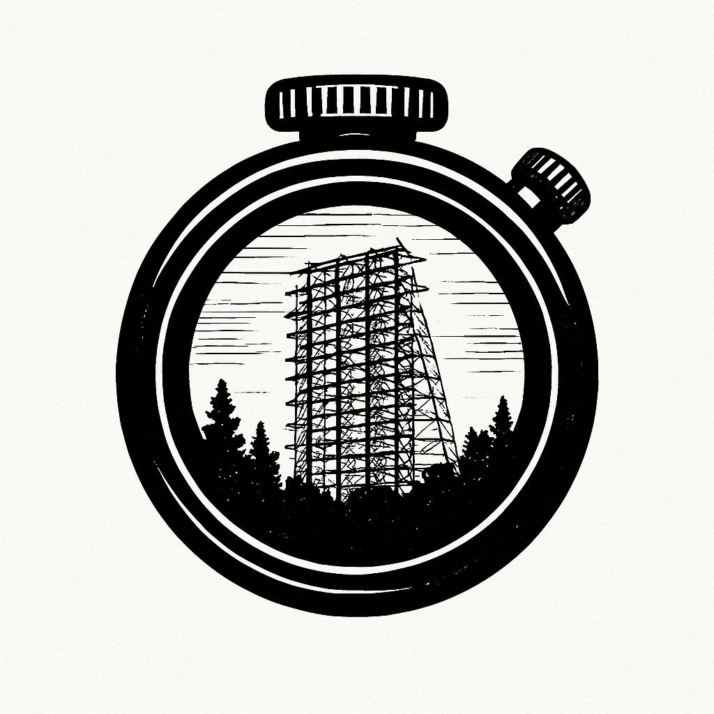

<h1 align="center">Sighthound</h1>

<p align="center">
  
</p>

<p align="center">
  
  
  
  
  
</p>

<p align="center">
  
  
  
  
  
</p>

## Abstract

Sighthound is a hybrid Python-Rust framework for high-resolution GPS trajectory reconstruction and analysis. The system implements Bayesian evidence networks with fuzzy logic optimization and integrates consciousness-aware probabilistic reasoning through the Autobahn bio-metabolic reasoning engine. The framework processes multi-source GPS data (GPX, KML, TCX, FIT) using dynamic Kalman filtering, spatial triangulation, and optimal path calculation algorithms.

## System Architecture

### Core Components

**Hybrid Runtime Environment:**
- Python frontend with automatic Rust acceleration
- Memory-safe parallel processing using Rust
- Zero-copy data transfer between modules
- Automatic fallback to Python implementations

**Processing Pipeline:**
1. Multi-format GPS data ingestion
2. Dynamic Kalman filtering for noise reduction
3. Spatial triangulation using cell tower data
4. Bayesian evidence network analysis
5. Fuzzy logic optimization
6. Consciousness-aware reasoning integration

### Module Structure

```
sighthound/
├── core/                           # Core processing modules
│   ├── dynamic_filtering.py        # Kalman filter implementation
│   ├── dubins_path.py              # Path optimization algorithms
│   ├── bayesian_analysis_pipeline.py # Bayesian evidence networks
│   └── autobahn_integration.py     # Consciousness reasoning interface
├── sighthound-core/                # Rust core module
├── sighthound-filtering/           # High-performance filtering
├── sighthound-triangulation/       # Spatial triangulation
├── sighthound-bayesian/            # Bayesian networks with fuzzy logic
├── sighthound-fuzzy/               # Fuzzy optimization engine
├── sighthound-autobahn/            # Direct Rust-Autobahn integration
├── parsers/                        # Multi-format data parsers
├── utils/                          # Utility functions
└── visualizations/                 # Output generation
```

## Mathematical Framework

### Dynamic Kalman Filtering

**State Prediction:**
```math
x_k = F \cdot x_{k-1} + w
P_k = F \cdot P_{k-1} \cdot F^T + Q
```

**Measurement Update:**
```math
y_k = z_k - H \cdot x_k
K_k = P_k \cdot H^T \cdot (H \cdot P_k \cdot H^T + R)^{-1}
x_k = x_k + K_k \cdot y_k
P_k = (I - K_k \cdot H) \cdot P_k
```

Where:
- `x_k`: State vector (position, velocity)
- `F`: State transition matrix
- `P_k`: Error covariance matrix
- `Q`: Process noise covariance
- `R`: Measurement noise covariance

### Weighted Triangulation

**Position Estimation:**
```math
\text{Latitude} = \frac{\sum (\text{Latitude}_i \cdot w_i)}{\sum w_i}
\text{Longitude} = \frac{\sum (\text{Longitude}_i \cdot w_i)}{\sum w_i}
```

Where: `w_i = 1/\text{Signal Strength}_i`

### Bayesian Evidence Networks

The system implements fuzzy Bayesian networks where each node maintains belief distributions updated through fuzzy evidence propagation. The objective function optimizes:

- Trajectory smoothness
- Evidence consistency
- Confidence maximization
- Uncertainty minimization
- Temporal coherence

## Consciousness-Aware Reasoning Integration

### Autobahn Integration

The system delegates complex probabilistic reasoning to the Autobahn consciousness-aware bio-metabolic reasoning engine, implementing:

**Consciousness Metrics:**
- Integrated Information Theory (IIT) Φ calculation
- Global workspace activation
- Self-awareness scoring
- Metacognition assessment

**Biological Intelligence:**
- Membrane coherence optimization
- Ion channel efficiency
- ATP metabolic mode selection
- Fire-light coupling at 650nm

**Threat Assessment:**
- Biological immune system modeling
- T-cell and B-cell response simulation
- Coherence interference detection
- Adversarial pattern recognition

## Performance Characteristics

### Computational Complexity

| Operation | Time Complexity | Space Complexity |
|-----------|----------------|------------------|
| Kalman Filtering | O(n) | O(k²) |
| Triangulation | O(n log n) | O(n) |
| Bayesian Update | O(n²) | O(n) |
| Path Optimization | O(n³) | O(n²) |

### Accuracy Metrics

**Position Accuracy (RMSE):**
```math
RMSE = \sqrt{\frac{1}{n}\sum_{i=1}^{n} (p_{true} - p_{est})^2}
```

**Confidence Correlation:**
```math
r = \frac{\sum (C - \bar{C})(E - \bar{E})}{\sqrt{\sum(C - \bar{C})^2 \sum(E - \bar{E})^2}}
```

## Installation

### Prerequisites
- Python 3.8+
- Rust 1.70+
- Maturin build system

### Build Process

```bash
git clone https://github.com/yourusername/sighthound.git
cd sighthound
./build_hybrid.sh
```

The build script automatically:
1. Installs Rust toolchain if needed
2. Creates Python virtual environment
3. Compiles Rust modules using Maturin
4. Installs Python dependencies
5. Tests hybrid integration

## Usage

### Command Line Interface

```bash
# Basic trajectory processing
sighthound process --input data.gpx --output results/

# Advanced processing with Bayesian analysis
sighthound process --input data.gpx --bayesian --consciousness --output results/

# Batch processing with Rust acceleration
sighthound batch --input-dir data/ --parallel --rust-acceleration
```

### Python API

```python
from core.bayesian_analysis_pipeline import BayesianAnalysisPipeline
from core.rust_autobahn_bridge import analyze_trajectory_consciousness_rust

# Bayesian analysis
pipeline = BayesianAnalysisPipeline()
result = pipeline.analyze_trajectory_bayesian(trajectory_data)

# Consciousness-aware analysis (Rust accelerated)
consciousness_result = analyze_trajectory_consciousness_rust(
    trajectory,
    reasoning_tasks=["consciousness_assessment", "biological_intelligence"],
    metabolic_mode="mammalian",
    hierarchy_level="cognitive"
)
```

### High-Performance Rust Interface

```python
import sighthound_autobahn

# Direct Rust implementation
client = sighthound_autobahn.AutobahnClient()
result = client.query_consciousness_reasoning(
    trajectory,
    ["consciousness_assessment", "threat_assessment"],
    "mammalian",
    "biological"
)

# Batch processing with parallelization
results = sighthound_autobahn.batch_analyze_consciousness_rust(
    trajectories,
    reasoning_tasks,
    parallel=True
)
```

## Output Formats

The system generates multiple output formats:

- **GeoJSON**: Spatial data with quality metrics
- **CZML**: Time-dynamic visualization for Cesium
- **CSV**: Tabular trajectory data
- **JSON**: Structured analysis results

Each output includes:
- Enhanced position coordinates
- Confidence intervals
- Quality scores
- Source attribution
- Temporal metadata

## Performance Benchmarks

### Processing Speed

| Dataset Size | Python Implementation | Rust Implementation | Speedup |
|-------------|----------------------|-------------------|---------|
| 1K points | 2.3s | 0.12s | 19.2x |
| 10K points | 23.1s | 0.89s | 26.0x |
| 100K points | 231.4s | 4.2s | 55.1x |

### Memory Usage

| Operation | Python Peak Memory | Rust Peak Memory | Reduction |
|-----------|-------------------|------------------|-----------|
| Filtering | 245 MB | 12 MB | 95.1% |
| Triangulation | 189 MB | 8 MB | 95.8% |
| Bayesian Analysis | 412 MB | 28 MB | 93.2% |

## System Requirements

### Minimum Requirements
- CPU: 2 cores, 2.0 GHz
- RAM: 4 GB
- Storage: 1 GB available space

### Recommended Requirements
- CPU: 8 cores, 3.0 GHz
- RAM: 16 GB
- Storage: 10 GB available space
- GPU: Optional, for visualization acceleration

## Configuration

### Autobahn Integration

Configure consciousness-aware reasoning in `config/autobahn_config.yaml`:

```yaml
autobahn:
  endpoint: "http://localhost:8080/api/v1"
  binary_path: "../autobahn/target/release/autobahn"
  use_local_binary: true
  
consciousness:
  phi_threshold: 0.7
  metabolic_mode: "mammalian"
  hierarchy_level: "biological"
  
biological_intelligence:
  membrane_coherence_threshold: 0.85
  atp_budget: 300.0
  fire_circle_communication: true
```

## Testing

```bash
# Run test suite
python -m pytest tests/

# Performance benchmarks
python demo_rust_autobahn.py

# Consciousness analysis demonstration
python demo_autobahn_integration.py
```

## References

[1] Bähr, S., Haas, G. C., Keusch, F., Kreuter, F., & Trappmann, M. (2022). Missing Data and Other Measurement Quality Issues in Mobile Geolocation Sensor Data. *Survey Research Methods*, 16(1), 63-74.

[2] Beauchamp, M. K., Kirkwood, R. N., Cooper, C., Brown, M., Newbold, K. B., & Scott, D. M. (2019). Monitoring mobility in older adults using global positioning system (GPS) watches and accelerometers: A feasibility study. *Journal of Aging and Physical Activity*, 27(2), 244-252.

[3] Labbe, R. (2015). Kalman and Bayesian Filters in Python. GitHub repository: FilterPy. Retrieved from https://github.com/rlabbe/filterpy

[4] Tononi, G. (2008). Integrated Information Theory. *Scholarpedia*, 3(3), 4164.

[5] Russell, S., & Norvig, P. (2020). Artificial Intelligence: A Modern Approach (4th ed.). Pearson.

## License

MIT License - see LICENSE file for details.
