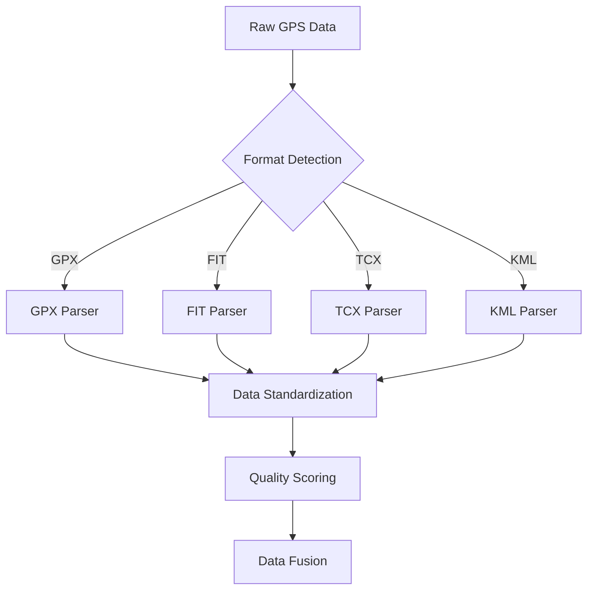
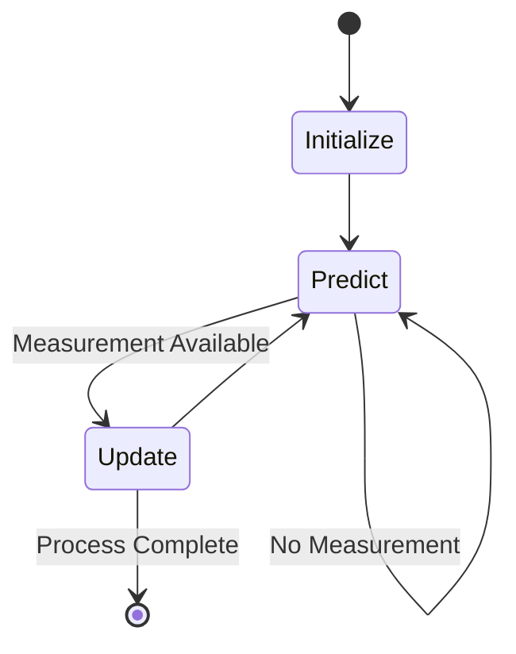
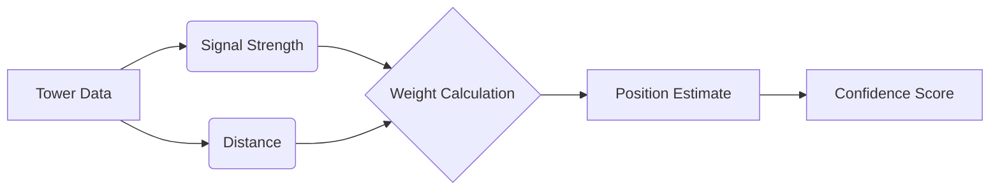

# Sighthound


Sighthound is a python package that applies line-of-sight principles in reconstructing high resolution geolocation data from the combined output of all inter and intra vendor
activity annotation files from consumer grade and commercially available wearable activity tracking smart watches.
It fuses data from multiple sources, applies dynamic filtering, triangulates positions, calculates optimal and Dubin's paths, and provides structured JSON outputs. Built for researchers and analysts, it leverages mathematical models and geospatial techniques for accurate and meaningful results.

---

## Features and Theoretical Explanations

### 1. **Multi-Source GPS Data Fusion**

Combines GPS data from various formats (GPX, KML, TCX, FIT). Missing data points are handled using **linear interpolation**:

$$
x(t) = x_1 + \frac{t - t_1}{t_2 - t_1} \cdot (x_2 - x_1)
$$

Where:

$$t: \text{ Missing timestamp}$$

$$x(t): \text{ Interpolated value}$$

$$t_1, t_2: \text{ Known timestamps before and after } t$$

$$x_1, x_2: \text{ GPS values at } t_1, t_2$$

#### Data Source Quality Matrix

| Source Type | Temporal Resolution | Spatial Accuracy | Typical Use Case |
|-------------|-------------------|------------------|------------------|
| GPX | 1-5s | 5-10m | Outdoor Activities |
| FIT | 1s | 3-5m | Sports Training |
| TCX | 1s | 3-5m | Fitness Tracking |
| KML | Variable | 5-15m | Route Planning |



### 2. **Dynamic Kalman Filtering**

The Kalman filter smooths noisy GPS data and predicts missing points by modeling the system state:

#### Prediction Step:

$$
\begin{aligned}
x_k &= F \cdot x_{k-1} + w \\
P_k &= F \cdot P_{k-1} \cdot F^T + Q
\end{aligned}
$$

Where:

$$x_k: \text{ State vector (position, velocity)}$$

$$F: \text{ State transition matrix}$$

$$w: \text{ Process noise}$$

$$P_k: \text{ Error covariance matrix}$$

$$Q: \text{ Process noise covariance}$$

#### Update Step:

$$
\begin{aligned}
y_k &= z_k - H \cdot x_k \\
K_k &= P_k \cdot H^T \cdot (H \cdot P_k \cdot H^T + R)^{-1} \\
x_k &= x_k + K_k \cdot y_k \\
P_k &= (I - K_k \cdot H) \cdot P_k
\end{aligned}
$$

Where:

$$z_k: \text{ Measurement vector}$$

$$H: \text{ Observation matrix}$$

$$K_k: \text{ Kalman gain}$$

$$R: \text{ Measurement noise covariance}$$

#### Filter Performance Characteristics

| Scenario | Accuracy Improvement | Computational Cost |
|----------|---------------------|-------------------|
| High Noise | 40-60% | High |
| Missing Data | 20-30% | Medium |
| Regular Updates | 10-20% | Low |



### 3. **Triangulation**

Position refinement using cell tower data employs weighted triangulation:

$$
\begin{aligned}
\text{Latitude} &= \frac{\sum (\text{Latitude}_i \cdot w_i)}{\sum w_i} \\
\text{Longitude} &= \frac{\sum (\text{Longitude}_i \cdot w_i)}{\sum w_i}
\end{aligned}
$$

Where:

$$ w_i = \frac{1}{\text{Signal Strength}_i} \text{ for each tower } i$$

#### Tower Weight Distribution

| Signal Strength (dBm) | Weight Factor | Confidence Level |
|----------------------|---------------|------------------|
| > -70 | 1.0 | High |
| -70 to -85 | 0.8 | Medium-High |
| -85 to -100 | 0.5 | Medium |
| < -100 | 0.2 | Low |



### 4. **Optimal Path Calculation**

The optimal path is computed using external routing APIs (e.g., Mapbox). The shortest path algorithm leverages Dijkstra's or A*:

#### **Dijkstra's Algorithm**


$$\text{dist}[v] = \min(\text{dist}[u] + w(u, v))$$


Where:

- 
  $$( \text{dist}[v] ): Shortest distance to vertex ( v )$$.

- 
  $$( w(u, v) ): Weight of the edge from ( u ) to ( v )$$.


#### **A***:

Heuristic-enhanced version of Dijkstra:

$$
f(v) = g(v) + h(v)
$$

Where:

- 
  $$( g(v) ): Cost from start to ( v )$$.

- 
  $$( h(v) ): Heuristic estimate of cost to goal$$.
 

---

### 5. **Dubin's Path**

Dubin's path calculates the shortest path for vehicles or humans with turning constraints. It uses circular arcs and straight-line segments:

#### **Types of Dubin's Paths**

1. **Left-Straight-Left (LSL)**:
   
   $$\text{Path} = R \cdot (\theta_1 + \pi) + L + R \cdot (\theta_2 + \pi)$$
   
2. **Right-Straight-Right (RSR)**:
   
   $$\text{Path} = R \cdot (\theta_1) + L + R \cdot (\theta_2)$$
   

Where:


$$( R )$$

: Turning radius.

- 
  $( L )$: Length of the straight segment
- 
  $( \theta_1, \theta_2 )$: Angular changes 
 

---

## Installation

Clone the repository and install dependencies:

```bash
git clone https://github.com/yourusername/sighthound.git
cd sighthound
pip install -r requirements.txt
```

## 6. Output Formats

The framework supports multiple output formats:
- CSV with enhanced trajectory data
- CZML for visualization in Cesium
- GeoJSON for web mapping applications

Each output includes:
- Enhanced position data
- Confidence metrics
- Source attribution
- Quality scores

## 7. Performance Metrics

The system's performance is evaluated using:

1. **Position Accuracy:**
   ```math
   RMSE = \sqrt{\frac{1}{n}\sum_{i=1}^{n} (p_{true} - p_{est})^2}
   ```

2. **Confidence Correlation:**
   ```math
   r = \frac{\sum (C - \bar{C})(E - \bar{E})}{\sqrt{\sum(C - \bar{C})^2 \sum(E - \bar{E})^2}}
   ```
   Where C is confidence and E is error.

## 8. Future Work

- Implementation of machine learning-based confidence scoring
- Support for additional data sources
- Real-time processing capabilities
- Enhanced error modeling and propagation

## 9. References

[1] Bähr, S., Haas, G. C., Keusch, F., Kreuter, F., & Trappmann, M. (2022). Missing Data and Other Measurement Quality Issues in Mobile Geolocation Sensor Data. *Survey Research Methods*, 16(1), 63-74. https://doi.org/10.18148/srm/2022.v16i1.7497

[2] Beauchamp, M. K., Kirkwood, R. N., Cooper, C., Brown, M., Newbold, K. B., & Scott, D. M. (2019). Monitoring mobility in older adults using global positioning system (GPS) watches and accelerometers: A feasibility study. *Journal of Aging and Physical Activity*, 27(2), 244-252. https://doi.org/10.1123/japa.2017-0311

[3] Labbe, R. (2015). Kalman and Bayesian Filters in Python. GitHub repository: FilterPy. Retrieved from https://github.com/rlabbe/filterpy

These references support key components of SightHound:
- [1] addresses challenges in mobile geolocation data quality and missing data handling
- [2] validates GPS data fusion methodologies in real-world applications
- [3] provides theoretical foundation for the Kalman filtering implementations

## License

MIT License - see LICENSE file for details
